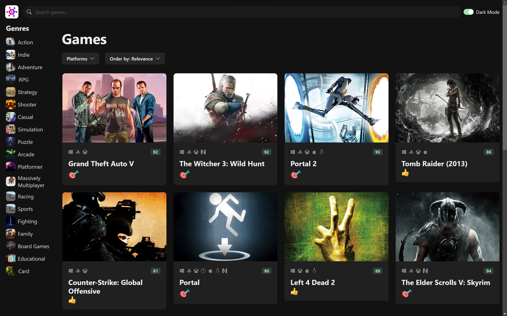

# game-hub

Coding with Mosh: React 18 for Beginners

## Description
This static application was developed in [React](https://react.dev/) on a [Node.js](https://nodejs.org) server. The application was designed to mimic [RAWG.io](https://rawg.io) and pulls game data through their API. The application provides users a number of filter options, a search bar, and a light/dark theme switcher.

## App preview
  
To view this app, navigate to the following address:  
[https://game-hub-pi-orcin.vercel.app/](https://game-hub-pi-orcin.vercel.app/)
